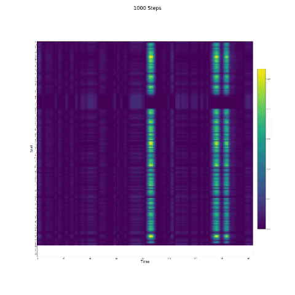
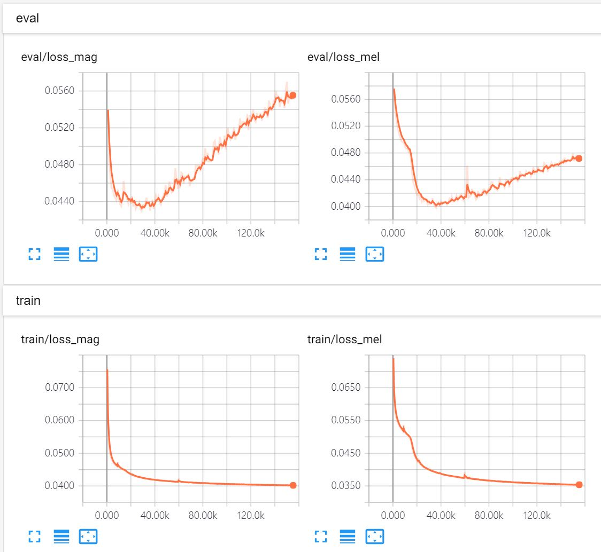

# Tacotron - pytorch implementation
### Paper: [Tacotron: Towards End-to-End Speech Synthesis](https://arxiv.org/abs/1703.10135)

## Prerequisite
- python 3.6
- pytorch 1.0
- librosa, scipy, tqdm, tensorboardX

## Dataset
- [LJ Speech 1.1](https://keithito.com/LJ-Speech-Dataset/), female single speaker dataset.
- I follow [Kyubyong's DCTTS repo with TensorFlow](https://github.com/Kyubyong/dc_tts) for preprocessing speech signal data. It actually worked well.

## Usage
1. Download the above dataset and modify the path in config.py. And then run the below command. 1st arg: signal prepro, 2nd arg: metadata (train/test split)
    ```
    python prepro.py 1 1
    ```

2. The model needs to train 100k+ steps (10+ hours).
    ```
    python train.py
    ```

3. After training, you can synthesize some speech from text.
    ```
    python synthesize.py
    ```

## Attention
- In speech synthesis, the attention module is important. If the model is normally trained, then you can see the monotonic attention like the follow figures.



## Notes
- Evaluation loss converges quickly, but attention converges slow.
- In synthesis step, the model will load the best. But the latest is better.
- I used bilinear attention instead of MLP attention in the model.


## Other Codes
- [Kyubyong's TensorFlow implementation](https://github.com/Kyubyong/tacotron)